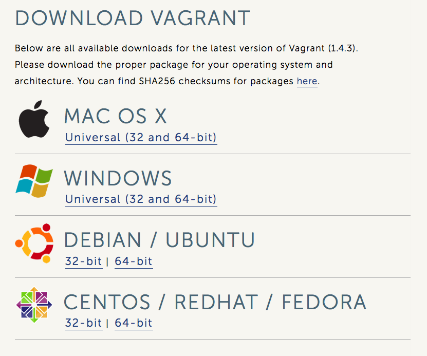

class: center, middle

# Vagrant

Toby Cole, Technical Architect, Semantico

---

# What am I talking about?

* What is Vagrant
* Installing 
* Starting
* Configuring
* Use-cases

---

# What is vagrant?

* VM management layer
* Designed for devs
* Portable, disposable images
* Multiple VM providers (virtualbox, VMware, AWS…)
* Shareable config (can be checked into projects!)

---

# Installation (easy way)

    ➜  ~  brew cask install vagrant
    
---
    
# Installation (hard way)

---

# First VM

    ➜  ~  vagrant init precise32 http://files.vagrantup.com/precise32.box
    ➜  ~  vagrant up
    
Lets go!

---

# More commands

    ➜  ~  vagrant ssh
    ➜  ~  vagrant destroy

---

# Don't 'rm -rf /'

* Current directory is mounted on /vagrant
* Handy since you have a known path to your project
* It's **writable**

---

# Config is ruby

    ➜  ~  cat Vagrantfile
    Vagrant.configure("2") do |config|
        config.vm.box = "precise32"
    end

---

# Provisioning

* Many built in providers
   * shell scripts
   * puppet
   * ansible
   * chef
   * docker
   * salt